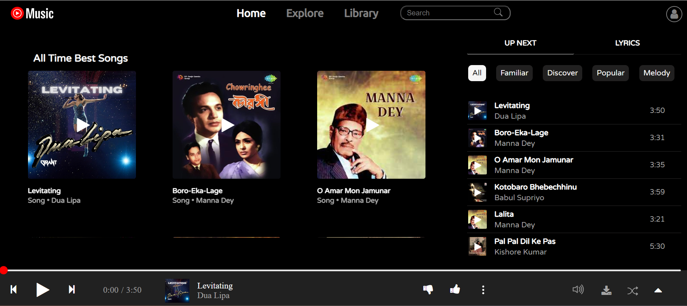
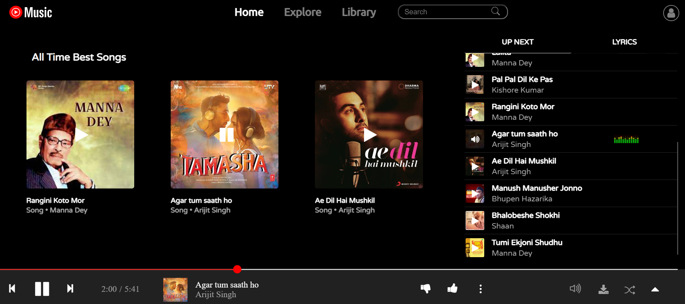

# Yt-Music---clone
This is a clone of YouTube Music. It presently has the ability to play downloaded songs from local machine.
## Authors

- [@codec404](https://github.com/codec404)


## Installation

Clone this project with git clone command in the terminal

```bash
git clone https://github.com/codec404/Yt-Music---clone
```
    
## Testing And Modification

To test and modify this project install VS Code extension ``` live server ``` and run it.

A localhost server will open and we can test our webpage running its several features.

## Documentation

[Documentation](https://developer.mozilla.org/en-US/docs/Learn)

The above link leads to the official MDN documentation page. It will be helpful for the users to get knowledge about the several topics on HTML, CSS and JavaScript.
## Features

- Play pre-downloaded songs from the list  

- Display Lyrics of the particular songs
- Control Volume of the song


